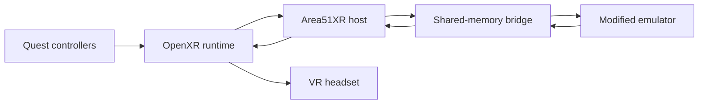

<p align="center">
  <strong>FORTYDUBZ PRESENTS</strong>
</p>

<h1 align="center">Area51XR</h1>

<p align="center">
  The original 1995 <em>Area 51</em> arcade light-gun experience, presented in a modern PCVR headset through OpenXR.
</p>

<p align="center">
  
</p>

<p align="center">
  <sub>Original <em>Area 51</em> cover artwork is shown only to identify the compatible game. Area51XR is an independent project and is not affiliated with or endorsed by the original game's rights holders.</sub>
</p>

<p align="center">
  
  
  
  
  
</p>

## What is Area51XR?

Area51XR is a Windows PCVR compatibility layer for the 1995 <em>Area 51</em> arcade game. It preserves the original game logic, video, audio, timing, and light-gun behavior while presenting the game on a virtual screen and mapping modern tracked VR controllers to the Player 1 arcade gun.

This is not a remake, recreation, or bundled copy of the game. Area51XR connects a purpose-built OpenXR host to a modified open-source arcade emulator component. Players must provide legally obtained compatible game media.

The v1.0 target is a focused, stable flat-screen VR light-gun experience that feels immediate and arcade-authentic.

## Highlights

- Original Area 51 arcade gameplay in PCVR
- Meta Quest 3 hardware tested
- Identical left-hand and right-hand controller support
- Automatic active-hand switching
- Tracked controller aiming and trigger input
- Authentic off-screen reload
- In-headset pause, resume, restart, and quit menu
- Custom **FORTYDUBZ PRESENTS** startup screen
- Restart returns through the Fortydubz splash
- Process-scoped OpenXR runtime selection
- MAME low-latency mode and fresher-frame sampling
- Automatic legal-media verification before launch
- Local runtime, host, and emulator diagnostics
- Standalone player package with no developer toolchain required
- No ROMs, CHDs, or original game assets distributed

## Controls

| Action | Left controller | Right controller |
|---|---|---|
| Aim | Controller aim | Controller aim |
| Fire | Trigger | Trigger |
| Reload | Aim outside the game screen and pull trigger | Aim outside the game screen and pull trigger |
| Insert coin | Y | B |
| Start or continue | X | A |
| Open or close pause menu | Thumbstick click | Thumbstick click |
| Select menu item | Point and pull trigger | Point and pull trigger |

The pause menu provides:

- **Resume**
- **Restart Game**
- **Quit Area51XR**

Keyboard fallback controls remain available:

| Key | Action |
|---|---|
| `5` | Insert coin |
| `1` | Player 1 start |

Starting or continuing normally consumes one arcade credit.

## Tested compatibility

| Headset | Connection | OpenXR runtime | Status |
|---|---|---|---|
| Meta Quest 3 | Virtual Desktop | VDXR | Hardware validated |
| Meta Quest 3 | Virtual Desktop | SteamVR | Hardware validated |
| Meta Quest 3 | Meta Horizon Link or Air Link | Meta OpenXR | Launcher support implemented, hardware test blocked by Meta PC software |
| Meta Quest 3 | Steam Link | SteamVR | Not yet hardware validated |

VDXR is the primary known-good runtime. SteamVR has also completed the full gameplay test through Virtual Desktop.

## How it works



Area51XR reads tracked controller input from OpenXR, projects the active controller ray onto the virtual game screen, and sends normalized light-gun coordinates and cabinet controls through a low-latency shared-memory bridge. The modified emulator publishes the latest game framebuffer back through that bridge for presentation in the headset.

## Player quick start

1. Extract the entire `Area51XR-1.0.0-win64.zip` into a normal writable folder.
2. Connect the headset to the PC before launching Area51XR.
3. Supply compatible Area 51 game media that you are legally entitled to use.
4. Double-click `Play Area51XR.cmd`.
5. Put on the headset and play.

The standalone player does not require Git, CMake, Ninja, MSYS2, or a source checkout.

### Default media layout

```text
Area51XR-1.0.0-win64/
└── media/
    └── area51/
        ├── 2-c_area_51_hh.hh
        ├── 2-c_area_51_hl.hl
        ├── 2-c_area_51_lh.lh
        ├── 2-c_area_51_ll.ll
        ├── jagwave.rom
        └── area51.chd
```

Area51XR can also use an existing external media folder:

```powershell
powershell -ExecutionPolicy Bypass -File .\Start-Area51XR.ps1 `
    -RomPath "D:\MAME\roms"
```

The launcher audits the supplied media before starting VR. Incompatible or incomplete media is rejected with a clear diagnostic.

## Runtime selection

The player can select an installed OpenXR runtime automatically:

```powershell
powershell -ExecutionPolicy Bypass -File .\Start-Area51XR.ps1
```

A runtime can also be selected explicitly:

```powershell
powershell -ExecutionPolicy Bypass -File .\Start-Area51XR.ps1 -Runtime VDXR
powershell -ExecutionPolicy Bypass -File .\Start-Area51XR.ps1 -Runtime SteamVR
powershell -ExecutionPolicy Bypass -File .\Start-Area51XR.ps1 -Runtime MetaLink
```

Valid values are `Auto`, `Active`, `VDXR`, `SteamVR`, and `MetaLink`.

The headset connection and matching PCVR software must be active before Area51XR starts. For SteamVR through Virtual Desktop, launch SteamVR from inside Virtual Desktop and wait until the headset and controllers are connected before starting Area51XR.

## Performance guidance

- Connect the gaming PC to the VR router by Ethernet when using wireless PCVR.
- Keep the headset on a strong 5 GHz or 6 GHz wireless connection.
- Disconnect Windows Remote Desktop before evaluating VR performance.
- Do not sign out of Windows when disconnecting RDP.
- Leave the Area51XR launcher window open during play.
- Use VDXR as the first troubleshooting baseline on the validated Quest 3 setup.

Testing confirmed that an active RDP session can introduce visible latency even while VR is running locally on the gaming PC.

## Troubleshooting

Area51XR creates a timestamped folder under `logs\` for every session. It records:

- selected OpenXR runtime and manifest
- Area51XR host output
- OpenXR loader errors
- emulator output and errors
- VDXR diagnostics when available

If the headset does not connect:

1. Confirm the headset is already connected to the PC.
2. Confirm the selected runtime matches the active PCVR path.
3. For SteamVR, confirm its status window shows the headset and both controllers.
4. Retry with an explicit `-Runtime` option.
5. Review the newest folder under `logs\`.

If the game does not start, verify the ROM set and CHD match the emulator version included with the release.

## Building and testing from source

Development uses Windows, MSYS2 UCRT64, CMake, Ninja, the Khronos OpenXR loader, and a targeted modified emulator build.

Prepare the host, run the complete regression gate, build the emulator, and verify media:

```powershell
powershell -ExecutionPolicy Bypass -File .\scripts\prepare-play-build.ps1 `
    -RomPath "D:\MAME\roms"
```

Launch the development build:

```powershell
powershell -ExecutionPolicy Bypass -File .\scripts\play-area51-vr.ps1 `
    -RomPath "D:\MAME\roms" `
    -Runtime VDXR
```

Generate the Windows player and matching modified-emulator source archives:

```powershell
powershell -ExecutionPolicy Bypass -File .\scripts\package-release.ps1 `
    -Version "1.0.0"
```

The packaging pipeline:

- stages native runtime dependencies
- includes required third-party notices and licenses
- generates a SHA-256 manifest
- rejects Area 51 ROMs, CHDs, and known original media filenames
- creates the standalone Windows player ZIP
- creates the exact corresponding-source ZIP for the modified GPL emulator component

## Release contents

The public release is distributed as two matching archives:

| Archive | Purpose |
|---|---|
| `Area51XR-1.0.0-win64.zip` | Standalone Windows PCVR player |
| `Area51XR-1.0.0-mame-source.zip` | Complete corresponding source for the modified emulator component |

Both archives must remain associated with the same Area51XR release revision.

## Project scope

Included in v1.0:

- stable flat-screen VR presentation
- Player 1 light-gun gameplay
- mirrored controller support
- arcade cabinet controls
- pause, restart, and quit
- startup branding
- OpenXR runtime selection
- standalone Windows packaging and diagnostics

Experimental monocular depth reconstruction, spatial meshes, and other scene-conversion research are outside the v1.0 launch gate. They are not presented as finished v1.0 features.

## Legal and attribution

Area51XR does not contain or distribute Area 51 ROMs, CHDs, original executables, artwork, audio, video, or other copyrighted game assets. Users must provide game media they are legally entitled to use.

The bundled arcade emulator component is derived from the MAME project and distributed under its applicable GPL terms. Every player release is accompanied by the corresponding source archive for the exact modified build. OpenXR loader and toolchain notices are included with the player.

MAME is a registered trademark of Gregory Ember. Area51XR is an independent project and is not endorsed by or affiliated with MAMEdev, Atari Games, Mesa Logic, Time Warner Interactive, Meta, Valve, Virtual Desktop, Fandom, or the original game's rights holders.

## Release status

Area51XR `1.0.0` has completed release validation:

- complete Area51XR regression suite
- Area 51 media audit
- VDXR hardware gameplay test
- SteamVR hardware gameplay test through Virtual Desktop
- startup splash validation
- mirrored controller validation
- pause, resume, restart, and quit validation
- player and corresponding-source packaging
- no-game-media packaging guard
- clean launch from a freshly extracted player folder
- default media-folder discovery
- double-click launcher in automatic runtime mode

The first clean launch may report that default EEPROM values are being created. This is normal initialization of the emulator's local machine data.
